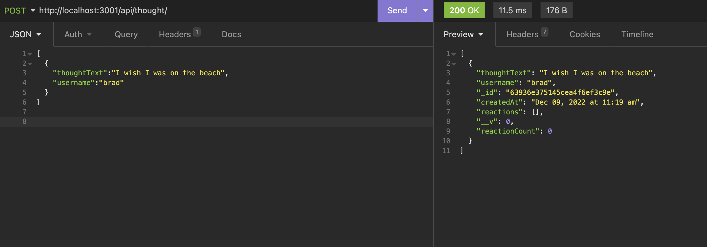
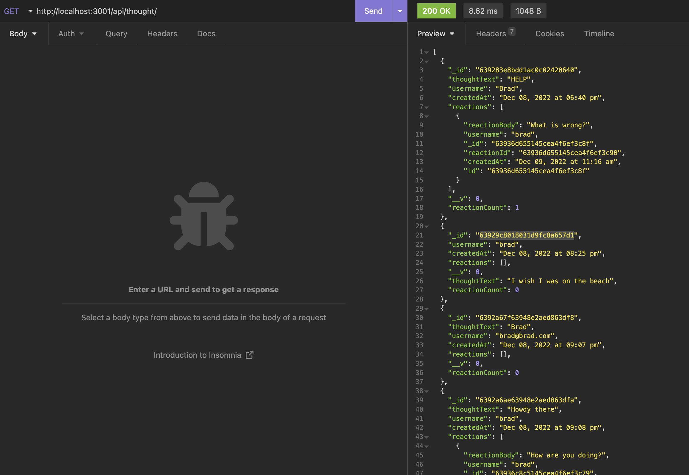
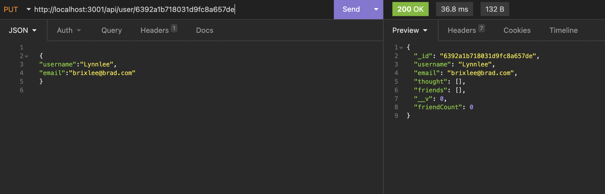

# NoSQL_Social_Network_API_via_Mongoose

This project was completed in order to showcase my ability to create a NoSQL API that could be utilized for a social network application.

## GitHub Repository

[NoSQL_Social_Network_API_via_Mongoose](https://github.com/Brad-Hambrick/NoSQL_Social_Network_API_via_Mongoose)

## Walk-through Video

[NoSQL_Social_Network_API_via_Mongoose walk through video](https://drive.google.com/file/d/1BrQYtXT3SN3Mk-pDrPLgJzQmgOR8JlFu/view?usp=share_link)

## Description

This project was completed in order to showcase my knowledge working with NoSql and utilizing mongoose in order to create a back end API that could be utilized to create a social network application. This application does not have a front end, it is 100% server side and demonstrates routing and the use of MongoDB Compass and insomnia to manipulate the database.

## Badges

All of the coding methods in this project were those that were learned during the Vanderbilt Coding Bootcamp as well as some open source searches related to NoSql and MongoDB Compass. This project also utilizes express, nodemon, exit-hook, and moment package installations. A regex is also utilized in order to validate email addresses that are submitted by users.

## Visuals

## Usage

This project is a back-end/server side application that could be utilized to create a social network app.

## Support

For support, contact Brad Hambrick @bradleyhambrick@gmail.com

## Roadmap

This project is built to a point of basic functionality however could have several more features added in order to grow the way that users interact with their thoughts and comments. I may potentially add a front end application in order to make it completely operational for users to have the ability to interact with one another.

## Contributing

This project is open to recommendations and future contributions.

## Authors and acknowledgment

Thanks to Vanderbilt Coding Bootcamp for contributing to the knowledge required to build this project.

## License

In this project NoSql is used to manage and manipulate the data. Also the aforemention NPM packages were installed as dev depencies to assist with coding convenience and routing.

## Project status

The project is still in the early phases but is operational for server side use and may be getting future improvements and alterations.
